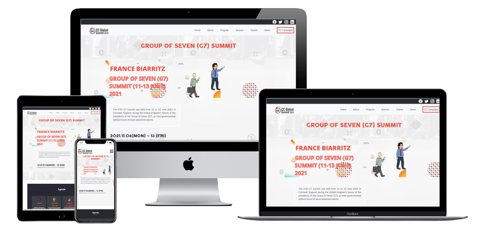

# Module-1_Capstone-1
# Capstone-1


> Capstone-1 Mobile & DEsktop Version


In this capstone project, I built an online website for a conference. I used the guidelines of the template created for Cindy Shin.The website is about Camp David conference of Group of Seven (G7). All the content was free images that I download from internet and design some of them with Canva.



## [LiveDemo] 
(https://fatima-hub333.github.io/Module-1_Capstone-1/)

## Built With

- HTML, CSS
- JavaScript
- Stylelint, Web Hint, Lighthouse


## Getting Started
To get a local copy up and running, follow the steps in Setup below.

### Prerequisites
Basic knowledge of HTML, CSS.

### Setup
If you installed git you can clone the code to your machine, or download a ZIP of all the files directly.

[Download the ZIP from this location](https://github.com/Fatima-hub333/Portfolio_Mobile_Version_Skeleton/archive/refs/heads/main.zip), or run the following [git](https://git-scm.com/downloads) command to clone the files to your machine:

```bash
git clone https://github.com/Fatima-hub333/Portfolio_Mobile_Version_Skeleton.git
```

- Once the files are on your machine, open the _Portfolio_ folder in [Visual Studio Code](https://code.visualstudio.com/).

- With the files open in Visual Studio Code, press the **Go Live** button at the bottom of the window to launch the files with [Live Server](https://marketplace.visualstudio.com/items?itemName=ritwickdey.LiveServer).

### Install

The following tools help make easier to work with sample code.

- [git](https://git-scm.com/downloads): A tool for managing source code
- [Visual Studio Code](https://code.visualstudio.com/): A source code editor
- [Live Server](https://marketplace.visualstudio.com/items?itemName=ritwickdey.LiveServer): A simple web server utility for Visual Studio Code

## Authors

👤 **Fatima Zahir**

- GitHub: [@githubhandle](https://github.com/Fatima-hub333)
- Twitter: [@twitterhandle](https://twitter.com/Fatima_developr)
- LinkedIn: [LinkedIn](https://www.linkedin.com/in/full-stack-webdeveloper-181583234/)

## 🤝 Contributing

Contributions, issues, and feature requests are welcome!

Feel free to check the [issues page](https://github.com/Fatima-hub333/Portfolio_Mobile_Version_Skeleton-1/issues).

## Show your support

Give a ⭐️ if you like this project!


## 📝 License

This project is [MIT](./MIT.md) licensed.
